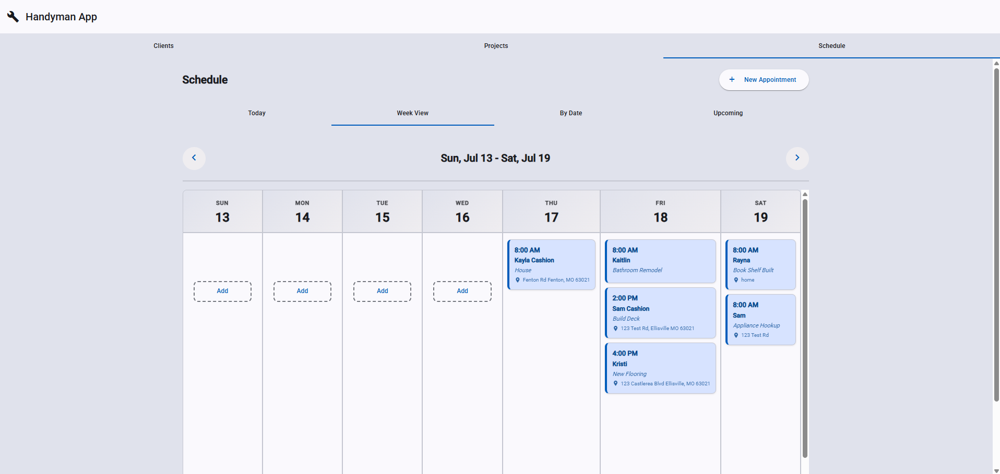
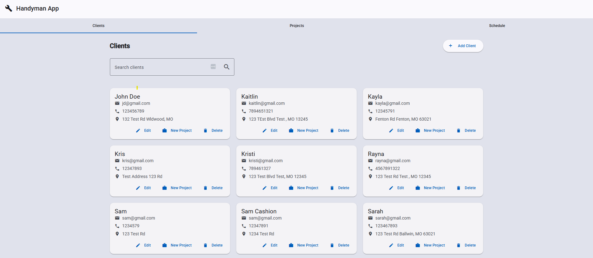
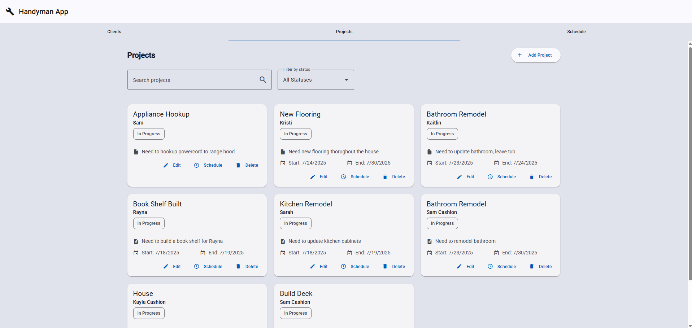

# 🔨 Handyman Business Management App

A comprehensive business management application designed specifically for handyman professionals and small service businesses. Built with Angular and Java Spring Boot, this application provides a complete solution for managing clients, projects, and scheduling.

   

## 🚀 Key Features

### 📱 **Mobile-First Design**
- **Responsive UI** - Optimized for phone, tablet, and desktop use
- **Touch-friendly** - Large buttons and easy navigation
- **Material Design** - Modern, clean interface using Angular Material

### 👥 **Client Management**
- **Complete client profiles** with contact information and addresses
- **Smart address integration** - Automatically populate appointment locations
- **Quick project creation** - Create projects directly from client cards
- **Search and filter** - Find clients quickly by name, email, or phone

### 📋 **Project Management**
- **Project tracking** with status management (Pending, In Progress, Completed, Cancelled)
- **Client association** - Link projects to specific clients
- **Integrated scheduling** - Schedule appointments directly from project creation
- **Project timeline** - Track project progress with visual status indicators

### 📅 **Advanced Scheduling System**
- **Today's Schedule** - Quick view of current day appointments
- **Week View** - Beautiful 7-day horizontal calendar layout
- **Date Picker** - Schedule appointments for any specific date
- **Upcoming View** - See all future appointments at a glance

### 🎯 **Streamlined Workflows**
- **One-Click Scheduling** - Create client + project + appointment in one form
- **Quick Actions** - Fast access buttons on cards for common tasks
- **Smart Defaults** - Auto-populate fields based on selected data
- **Bulk Operations** - Efficient management of multiple items

### 📝 **Appointment Features**
- **Time Management** - Start/end times with duration tracking
- **Location Integration** - Use client addresses or custom locations
- **Notes System** - Detailed notes with enhanced visual display
- **Status Tracking** - Visual status indicators (Scheduled, In Progress, Completed, Cancelled)
- **Recurring Appointments** - Support for daily, weekly, and monthly recurring schedules

## 🛠️ Technology Stack

### Frontend
- **Angular 18+** - Modern TypeScript framework
- **Angular Material** - UI component library
- **Standalone Components** - Latest Angular architecture
- **Reactive Forms** - Form management and validation
- **RxJS** - Reactive programming for data handling

### Backend
- **Spring Boot 3.2.0** - Java application framework
- **Spring Data JPA** - Data persistence layer
- **H2 Database** - In-memory database for development
- **PostgreSQL** - Production database support
- **OpenAPI/Swagger** - API documentation
- **Maven** - Dependency management

## 🏗️ Architecture

```
┌─────────────────┐    ┌─────────────────┐
│   Angular       │    │   Spring Boot   │
│   Frontend      │◄──►│   Backend       │
│                 │    │                 │
│ • Components    │    │ • REST APIs     │
│ • Services      │    │ • JPA Entities  │
│ • Material UI   │    │ • Business Logic│
└─────────────────┘    └─────────────────┘
                              │
                              ▼
                    ┌─────────────────┐
                    │   Database      │
                    │   (H2/PostgreSQL│
                    └─────────────────┘
```

## 🚀 Getting Started

### Prerequisites
- Node.js (v20.19+ or v22.12+)
- Java 17+
- Maven 3.8+

### Installation

1. **Clone the repository**
   ```bash
   git clone https://github.com/yourusername/handyman-app.git
   cd handyman-app
   ```

2. **Start the Backend**
   ```bash
   cd backend
   ./mvnw spring-boot:run
   ```
   Backend will run on `http://localhost:8080`

3. **Start the Frontend**
   ```bash
   cd frontend
   npm install
   ng serve
   ```
   Frontend will run on `http://localhost:4200`

## 📱 Usage

### Creating a Complete Workflow
1. **Add a Client** - Enter client information and address
2. **Create Project** - Link project to client with optional scheduling
3. **Schedule Appointments** - Use the week view or date picker to schedule work
4. **Track Progress** - Update appointment and project status as work progresses

### Managing Your Schedule
- **Today Tab** - See what's scheduled for today
- **Week View** - Navigate between weeks to see your full schedule
- **Quick Add** - Click empty days to schedule new appointments
- **Status Updates** - Mark appointments as completed or cancelled

## 🎨 Screenshots

### Week View
Beautiful 7-day calendar layout with color-coded appointments and easy navigation.


### Client Management
Clean interface for managing client information with quick action buttons.


### Project Dashboard
Track all your projects with visual status indicators and smart filtering.


## 🤝 Contributing

1. Fork the repository
2. Create a feature branch (`git checkout -b feature/amazing-feature`)
3. Commit your changes (`git commit -m 'Add amazing feature'`)
4. Push to the branch (`git push origin feature/amazing-feature`)
5. Open a Pull Request

## 📄 License

This project is licensed under the MIT License - see the [LICENSE](LICENSE) file for details.
---

**Built with ❤️ for handyman professionals who deserve better business management tools.**
